<div align="center">



<br/>

[](https://github.com/)
[](https://github.com/)
[](https://github.com/)
[](https://github.com/)
[](https://github.com/)
[](LICENSE)

<br/>

**AuraDKit**은 126개 레퍼런스 사이트를 **7축**으로 학습하고, Claude Code에 주입해<br/>
**S-Grade UI**를 한 줄 명령으로 생성하는 디자인 지능 엔진입니다.

[시작하기](#-시작하기) · [명령어](#-명령어) · [7축 분석](#-7축-분석-엔진) · [레퍼런스 사이트](#-레퍼런스-사이트-126개) · [설정](#-환경-변수--설정-v501)

</div>

---

## ✦ AuraDKit이란?

디자인 도구가 아닙니다. **디자인 학습 엔진**입니다.

AuraDKit은 Awwwards·Linear·Stripe 수준의 사이트를 직접 크롤링하고 7개 축으로 분석합니다.
그 결과를 `SKILL.md`로 증류해 Claude Code에 주입하면, 모든 UI 생성 명령이 레퍼런스급
디자인 패턴을 자동으로 적용합니다.

```
쓰레기 AI UI의 시대는 끝났습니다.
```

| 항목 | 값 |
|------|-----|
| 학습 사이트 수 | **126개** (11개 카테고리) |
| 분석 축 | **7축** (타이포·색상·레이아웃·모션·컴포넌트·공간·계층) |
| 평균 디자인 점수 | **7.1 / 10** |
| Design Drift 점수 | **22 / 100** (낮을수록 좋음) |
| AI-Slop 점수 | **7 / 100** (낮을수록 좋음) |
| 페이지 패턴 | **10종** 내장 |

---

## 작동 원리

```mermaid
flowchart LR
    A["🌐 Reference Sites\n126개"] -->|"Playwright 크롤링"| B["📐 7-Axis\nAnalyzer"]
    B -->|"분석 결과 저장"| C[("📊 Knowledge\nBase")]
    C -->|"핵심 증류"| D["⚡ Skill\nCompiler"]
    D -->|"SKILL.md 생성"| E["📋 SKILL.md\n+ References"]
    E -->|"/auradkit 주입"| F["🤖 Claude Code"]
    F -->|"출력"| G["🎨 S-Grade\nUI Components"]

    style A fill:#1e1030,stroke:#a78bfa,color:#e2e8f0
    style B fill:#1e1030,stroke:#a78bfa,color:#e2e8f0
    style C fill:#0a1a28,stroke:#22d3ee,color:#e2e8f0
    style D fill:#0a1a28,stroke:#22d3ee,color:#e2e8f0
    style E fill:#1e0830,stroke:#f472b6,color:#e2e8f0
    style F fill:#1e0830,stroke:#f472b6,color:#e2e8f0
    style G fill:#0a1e0a,stroke:#34d399,color:#e2e8f0
```



---

## 7축 분석 엔진

126개 사이트에서 실측한 기준값입니다.

| 축 | 기준 점수 | 분포 | 주요 분석 항목 |
|----|-----------|------|--------------|
| 🔤 Typography | **7.8**/10 | `████████░░` | 모듈러 스케일, 행간 1.4–1.75, 폰트 페어링 2종 |
| 📐 Spatial Rhythm | **7.8**/10 | `████████░░` | 4px 그리드, 평균 간격 12–32px |
| 🗂️ Layout | **7.7**/10 | `████████░░` | 반응형 3단계+, 시맨틱 구조 |
| 🎬 Motion | **6.9**/10 | `███████░░░` | transform/opacity만, 60fps 유지 |
| 🧩 Component | **6.7**/10 | `███████░░░` | 4상태 필수, 스타일 일관성 80%+ |
| 👁️ Visual Hierarchy | **6.6**/10 | `███████░░░` | H1+Hero+CTA 삼위일체, 시선 집중 |
| 🎨 Color | **6.5**/10 | `███████░░░` | OKLCH, WCAG AA 90%+ 통과 |

> **설계 기준**: 평균 7.1/10 · Drift 22/100 · AI-Slop 7/100

---

## ⚡ 시작하기

### 1단계 — 학습

```bash
# 의존성 설치
cd trainer && npm install

# Playwright 브라우저 설치
npx playwright install chromium

# 전체 레퍼런스 사이트 학습 (126개, ~40분)
npx auradkit-trainer learn --all

# 빠른 시작: 카테고리별 학습
npx auradkit-trainer learn --category=saas-landing
npx auradkit-trainer learn --category=design-system
```

### 2단계 — SKILL.md 컴파일

```bash
# 학습 결과를 Claude Code 스킬로 증류
npx auradkit-trainer compile

# 학습 현황 확인
npx auradkit-trainer status
```

### 3단계 — UI 생성

```bash
# Claude Code에서 스킬 활성화 후 사용
/auradkit 유저 대시보드 만들어줘
/auradkit --format=tsx 로그인 페이지
/auradkit --style=dark-luxury 가격 비교 페이지
/auradkit 결제 플로우 전체 설계
```

---

## 명령어

| 명령어 | 설명 |
|--------|------|
| `learn` | 인터랙티브 사이트 선택 후 학습 |
| `learn --all` | 전체 126개 레퍼런스 사이트 학습 |
| `learn --all --force` | 캐시 무시하고 전체 재크롤 |
| `learn --category=<name>` | 카테고리별 학습 |
| `learn <url>` | 단일 URL 학습 |
| `status` | 학습 현황 대시보드 |
| `compile` | SKILL.md 생성 |
| `report` | 전체 분석 리포트 출력 |
| `compare <url1,url2>` | 두 사이트 디자인 비교 |
| `drift-check <url>` | 디자인 Drift 감지 |
| `slop-check <url>` | AI Slop 패턴 감지 |

**카테고리**: `saas-landing` · `saas-dashboard` · `ecommerce` · `portfolio` · `blog` · `docs` · `design-system` · `startup` · `ai-product` · `creative` · `3d-creative`

---

## 레퍼런스 사이트 (126개)

<details>
<summary><strong>📋 전체 카테고리 · 주요 사이트 보기</strong></summary>

| 카테고리 | 대표 사이트 | 특징 |
|----------|------------|------|
| **SaaS Landing** | linear.app, vercel.com, liveblocks.io | 최고 전환율 패턴 |
| **SaaS Dashboard** | linear.app, retool.com, airplane.dev | 정보 밀도 + UX |
| **Design System** | radix-ui.com, shadcn/ui, magicui.design | 컴포넌트 일관성 |
| **Docs** | docs.anthropic.com, bun.sh, deno.com | 가독성 최적화 |
| **AI Product** | lovable.dev, v0.dev, cursor.sh | AI 네이티브 UI |
| **Ecommerce** | stripe.com, lemon.squeezy.com | 결제 최적화 |
| **Portfolio** | paco.me, rauno.me | 개성 + 기술력 |
| **Startup** | astro.build, framer.com | 성장 최적화 |
| **Creative** | awwwards.com, dribbble.com | 창의성 극대화 |
| **3D Creative** | bruno-simon.com, lusion.co | WebGL + 몰입감 |
| **Blog** | overreacted.io, leerob.io | 타이포그래피 극한 |

</details>

---

## 🔧 환경 변수 · 설정 (v5.0.1)

v5.0.1에서 모든 경로와 설정이 환경 변수로 완전히 제어됩니다.

| 변수 | 기본값 | 설명 |
|------|--------|------|
| `AURADKIT_KNOWLEDGE_BASE_DIR` | `../knowledge-base` | 지식 베이스 루트 경로 |
| `AURADKIT_ANALYSIS_DIR` | `<KB>/analysis` | 분석 JSON 저장 경로 |
| `AURADKIT_SCREENSHOT_DIR` | `<KB>/screenshots` | 스크린샷 저장 경로 |
| `AURADKIT_CACHE_DIR` | `<KB>/cache` | 크롤링 캐시 경로 |
| `AURADKIT_SKILL_OUTPUT_DIR` | `../.claude/skills/auradkit` | SKILL.md 출력 경로 |
| `AURADKIT_LOG_LEVEL` | `info` | `silent` \| `error` \| `warn` \| `info` \| `debug` |
| `AURADKIT_CACHE_TTL_DAYS` | `7` | 캐시 유효기간 (일) |
| `AURADKIT_CONCURRENCY` | `3` | 동시 크롤링 수 |
| `AURADKIT_PAGE_TIMEOUT_MS` | `30000` | 페이지 타임아웃 (ms) |
| `AURADKIT_MAX_RETRIES` | `3` | 최대 재시도 횟수 |

```bash
# .env 예시 (trainer/.env)
AURADKIT_CONCURRENCY=5
AURADKIT_CACHE_TTL_DAYS=14
AURADKIT_LOG_LEVEL=warn
AURADKIT_SKILL_OUTPUT_DIR=/custom/path/to/skills
```

---

## 디자인 원칙

학습을 통해 도출된 최고 신뢰도 원칙들입니다.

<details>
<summary><strong>🎯 핵심 원칙 10개 보기 (신뢰도순)</strong></summary>

| 신뢰도 | 원칙 | 축 |
|--------|------|----|
| **93%** | GPU 합성 레이어(`transform`, `opacity`)만 애니메이션 → 60fps 보장 | Motion |
| **93%** | 버튼 border-radius, 카드 스타일 80%+ 일관성 유지 | Component |
| **90%** | 페이지당 H1 하나 + Hero 섹션 + CTA 버튼 조합 | Visual Hierarchy |
| **89%** | 폰트 패밀리 2개 (헤딩 + 본문) 페어링이 최적 | Typography |
| **87%** | `[12,14,16,18,20,24,30,36,48,60,72]px` 모듈러 스케일 80%+ 준수 | Typography |
| **82%** | 본문 행간 1.4–1.75 황금 범위 | Typography |
| **75%** | 최소 3개 미디어 쿼리 브레이크포인트 (모바일/태블릿/데스크톱) | Layout |
| **67%** | `<header>` `<nav>` `<main>` `<footer>` 시맨틱 4 랜드마크 | Layout |
| **66%** | 텍스트-배경 색상 쌍의 90%+ → WCAG AA 4.5:1 이상 | Color |
| **65%** | 평균 간격 12–32px 범위 유지 | Spatial Rhythm |

</details>

---

## 출력 규칙 (모든 UI 생성 시 자동 적용)

<details>
<summary><strong>📐 AuraDKit 출력 표준 보기</strong></summary>

### 4상태 필수
모든 컴포넌트는 반드시 4가지 상태를 구현해야 합니다:

```html
<section data-state="default">  <!-- default | loading | empty | error -->
```

### CSS 토큰 시스템
```css
:root {
  /* 색상 (OKLCH + sRGB 폴백) */
  --aurad-primary:    oklch(0.55 0.15 250);  /* #3b82f6 */
  --aurad-text:       oklch(0.25 0.02 250);  /* #1e293b */
  --aurad-surface:    oklch(0.98 0.005 250); /* #f8fafc */

  /* 간격 (4px 배수) */
  --aurad-space-4:  1rem;    /* 16px */
  --aurad-space-8:  2rem;    /* 32px */
  --aurad-space-16: 4rem;    /* 64px */

  /* 타이포그래피 */
  --aurad-text-base: 1rem;   /* 16px */
  --aurad-text-2xl:  1.5rem; /* 24px */
  --aurad-text-4xl:  2.25rem;/* 36px */

  /* 모션 */
  --aurad-duration-normal: 250ms;
  --aurad-ease-default: cubic-bezier(0.4, 0, 0.2, 1);
}

/* Reduced motion — 항상 포함 */
@media (prefers-reduced-motion: reduce) {
  *, *::before, *::after {
    animation-duration: 0.01ms !important;
    transition-duration: 0.01ms !important;
  }
}
```

### Anti-Pattern 차단 규칙
1. `div` 중첩 3단계 초과 금지 → 시맨틱 HTML 사용
2. 인라인 스타일에 리터럴 값 금지 → `--aurad-*` 토큰 필수
3. 하드코딩된 HEX/RGB 금지 → CSS 커스텀 프로퍼티만
4. `outline: none` 금지 → `:focus-visible` + `--aurad-border-focus`
5. 레이아웃 속성(`width`, `height`, `top`) 트랜지션 금지

### WCAG AA 검증 색상 쌍
| 전경 | 배경 | 대비율 | 등급 |
|------|------|--------|------|
| `--aurad-text` | `--aurad-surface` | 7.2:1 | AAA |
| `--aurad-text-inverse` | `--aurad-primary` | 4.8:1 | AA |
| `--aurad-primary` | `--aurad-surface` | 4.6:1 | AA |

</details>

---

## 프로젝트 구조

<details>
<summary><strong>📁 전체 구조 보기</strong></summary>

```
AuraDkit/
├── assets/
│   └── banner.svg                   GitHub README 배너
├── trainer/                         디자인 학습 CLI (TypeScript)
│   ├── package.json
│   └── src/
│       ├── index.ts                 CLI 엔트리포인트 (v5.0.1)
│       ├── config.ts                중앙 설정 (VULN-004)
│       ├── cli/                     화려한 CLI UI
│       │   ├── logo.ts              그라데이션 로고 + 진행 헤더
│       │   ├── theme.ts             색상 테마 시스템
│       │   ├── summary.ts           결과 요약 렌더러
│       │   └── error-display.ts     에러 포맷터
│       ├── analyzer/                7축 디자인 분석
│       │   ├── color-analyzer.ts    색상 분석 (OKLCH, 대비)
│       │   ├── typography-analyzer.ts  타이포그래피
│       │   ├── layout-analyzer.ts   레이아웃·반응형
│       │   ├── motion-analyzer.ts   애니메이션 분석
│       │   ├── component-analyzer.ts   컴포넌트 품질
│       │   ├── spatial-rhythm-analyzer.ts  간격 시스템
│       │   ├── visual-hierarchy-analyzer.ts 시각 계층
│       │   ├── design-drift.ts      틀어짐 감지기
│       │   └── anti-ai-slop.ts      AI Slop 감지기
│       ├── crawler/
│       │   └── site-crawler.ts      Playwright 병렬 크롤러 (1× 브라우저 재사용)
│       ├── knowledge/
│       │   ├── principles.ts        디자인 원칙 처리
│       │   └── pattern-detector.ts  패턴 감지 + 사이트 비교
│       ├── output/
│       │   ├── skill-compiler.ts    SKILL.md 컴파일러
│       │   ├── json-writer.ts       지식 베이스 저장
│       │   └── markdown-writer.ts   리포트 생성
│       └── presets/
│           └── reference-sites.ts   126개 레퍼런스 사이트 목록
├── knowledge-base/
│   ├── principles/                  디자인 원칙 (git 포함)
│   ├── patterns/                    10종 페이지 패턴 (git 포함)
│   ├── drift-catalog/               Drift 감지 카탈로그 (git 포함)
│   ├── anti-ai-slop/                AI Slop 감지 규칙 (git 포함)
│   ├── analysis/                    ⚠️ 로컬 전용 — git 제외
│   ├── screenshots/                 ⚠️ 로컬 전용 — git 제외
│   └── cache/                       ⚠️ 로컬 전용 — git 제외
└── .claude/
    └── skills/
        └── auradkit/
            ├── SKILL.md             컴파일 출력 (스킬 진입점)
            └── references/          보조 참조 파일들
```

</details>

---

## 보안

```
knowledge-base/analysis/    → ⛔ git 커밋 금지 (로컬 크롤링 데이터)
knowledge-base/screenshots/ → ⛔ git 커밋 금지 (사이트 스크린샷)
knowledge-base/cache/       → ⛔ git 커밋 금지 (크롤링 캐시)
```

위 세 디렉토리는 `.gitignore`에 등록되어 있습니다. 실수로도 커밋하지 마세요.

SSRF 방지 — 내부 네트워크 주소(`localhost`, `10.x.x.x`, `192.168.x.x` 등)는
트레이너 CLI에서 자동 차단됩니다.

---

<div align="center">

**[index.html](index.html)** · **[SKILL.md](.claude/skills/auradkit/SKILL.md)** · **[CLAUDE.md](CLAUDE.md)**

<br/>

*AuraDKit v5.0.1 · Trained on 126 sites · Powered by [AuraKit](https://github.com/)*

<br/>

Made with **AuraKit** — The Full-Stack Claude Code Skill

</div>
